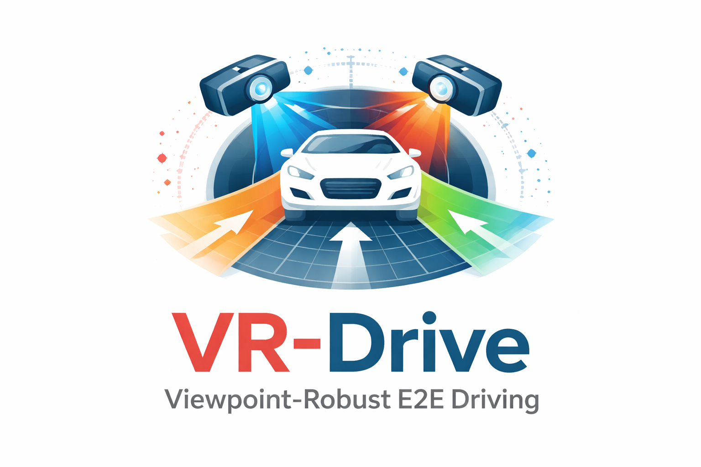

<div align="center">

<h1>VR-Drive</h1>
<h3>Viewpoint-Robust End-to-End Driving with Feed-Forward 3D Gaussian Splatting</h3>

[Hoonhee Cho](https://chohoonhee.github.io)<sup>1 &ast;</sup>, Jae-Young Kang<sup>1 &ast;</sup>, [Giwon Lee](https://giwonlee00.github.io)<sup>1 &ast;</sup>, Hyemin Yang<sup>1 &ast;</sup>, Heejun Park<sup>1</sup>, Seokwoo Jung<sup>2</sup>, [Kuk-Jin Yoon](https://vi.kaist.ac.kr)<sup>1 ✉</sup>

<sup>1</sup>KAIST, <sup>2</sup>42dot  
<sup>&ast;</sup>Equal contribution. <sup>✉</sup>Corresponding author.


[](https://openreview.net/pdf/a9479d1d90a2762ee248170d1f5844228e68a116.pdf)&nbsp;
[](https://vrdriveneurips.github.io/)&nbsp;


</div>

## News
* **` Jan. 4th, 2026`:** We release the initial version of our code for nuScenes, accompanied by comprehensive documentation and training/evaluation scripts.


## Table of Contents
- [Getting Started](#getting-started)
- [Acknowledgement](#acknowledgement)
- [Citation](#citation)


<div align="center"><b>Truncated Diffusion Policy.</b>

<b>Pipeline of DiffusionDrive. DiffusionDrive is highly flexible to integrate with onboard sensor data and existing perception modules.</b>

</div>


## Getting Started
- [Getting started from nuScenes environment preparation](https://github.com/swc-17/SparseDrive/blob/main/docs/quick_start.md)
- [Training and Evaluation](docs/train_eval.md)


## Acknowledgement
VR-Drive builds upon and is strongly influenced by several outstanding open-source projects, including [DiffusionDrive](https://github.com/hustvl/DiffusionDrive), [SparseDrive](https://github.com/swc-17/SparseDrive), [DrivingForward](https://github.com/fangzhou2000/DrivingForward).


## Citation
If you find VR-Drive helpful in your research or applications, we would appreciate a star 🌟 on this repository and a citation using the BibTeX entry below.

```bibtex
  @inproceedings{chovr,
    title={VR-Drive: Viewpoint-Robust End-to-End Driving with Feed-Forward 3D Gaussian Splatting},
    author={Cho, Hoonhee and Kang, Jae-Young and Lee, Giwon and Yang, Hyemin and Park, Heejun and Jung, Seokwoo and Yoon, Kuk-Jin},
    booktitle={The Thirty-ninth Annual Conference on Neural Information Processing Systems}
  }
```
